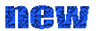

Title:    NEBBIO UENF  
Date:     Aug 15, 2019 

## Home
Nosso objetivo é ser uma ponte de comunicação entre alunos e o programa de pós-graduação em Biociências e Biotecnologia da UENF, 
buscando promover e consolidar o conhecimento científico, tecnológico e de inovação por meio de eventos na área.
[Link][Contact_Us.md]

## Ceating a new page to the main website. 
1. Copy the template.html file and rename it as desired page names (e.g newPage.html)  
2. edit the line as required within the <title> tags   
 ` <title>Template| NEBBIO</title> `
3. go to js/scripts.js file, add one line   under the function **populate_nav_sidebar()**  
  `h['Associações'] = 'newPage.html';`  
  The text within h['XXX'] will be visible on the website (Associações) and newPage.html is the link to the page.   
  

## Ceating a new page to the EVENT website.     
1. copy the 'event1' folder and rename it to desired event name (e.g omicas). Use small letters.
2. Put the following files as per the event name  
- fees.png : fees table  
- header_desktop.png : page header to show on Desktop site  
- header_mobile.png : page header to show on mobile site  
- poster.png: poster A4 size for the event  
3. open the index.html file.  
` 
# Edit the event name
<title>Events| NEBBIO</title> 
# Edit he background color is you want RGB and last one is opacity Alpha  . DONT change the 'event'

`

4. open the nebbiouenf.github.io/events.html page and add a link to the Event web page.
If it is the first event in a year, you have to edit 3 things.
`
#i. Keep the recet year on top
 <!-- Edit to add a new year --> 
 <li><a href="#2019">2019</a></li>
#ii. Add a new section of the year. Change all the 2019 to thecurrent year
<!-- Edit to add a new year section --> 	
      	<h3 id="2019" class="event_year">2019</h3>
         <ol type="I">
         </ol>
#ii. add an event to the year section <ol> tags
<!-- For each year section add a new event here--> 	
           <li><a href="omicas/index.html" target='_blank' >OMICAS (Date: 03/10/2019) </a></li>
`
5. If it is another event in the year just do the last step (iii). Change the name and event folder name and remove the new.gif image tag from old event.
`
 <!-- For each year section add a new event here--> 	
           <li><a href="genomics/index.html" target='_blank'>Genomics (Date: 22/10/2085) </a></li>
           <li><a href="omicas/index.html" target='_blank' >OMICAS (Date: 03/10/2019) <!-- REMOVE the new.gif image --> </a></li>
`
